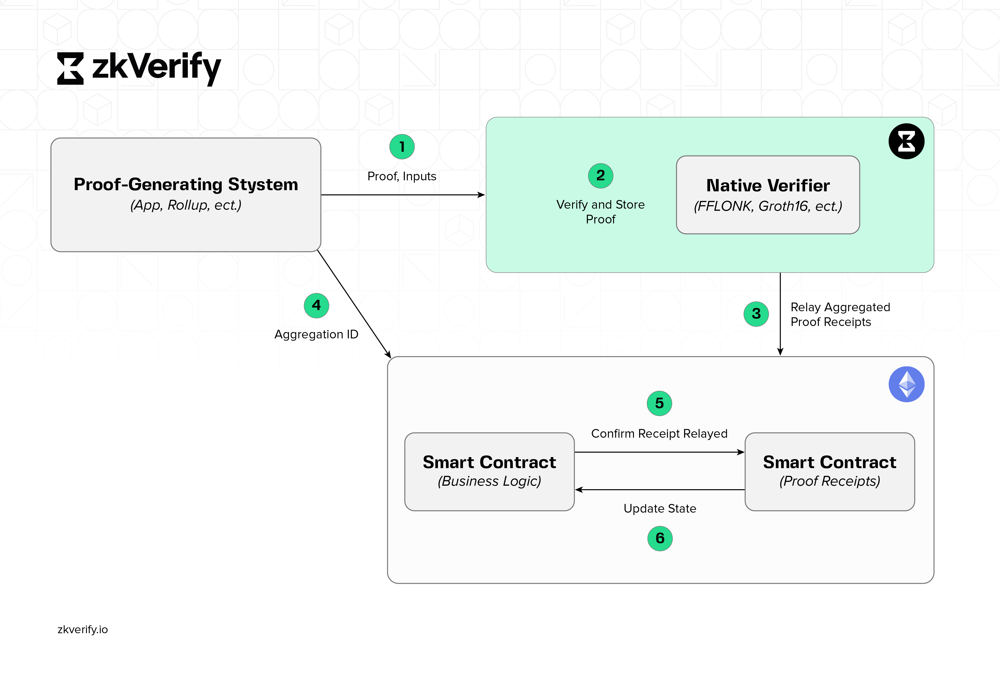
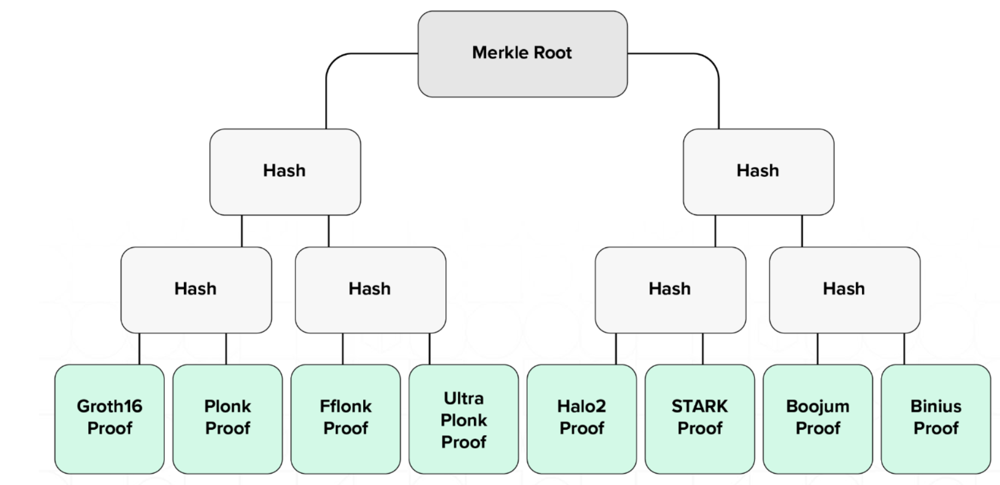

This guide will walk you through the workflow of using [zkVerify](https://zkverify.io/), the modular blockchain for ZK proof verification. By integrating with zkVerify, your dApp can leverage zero-knowledge proofs for enhanced security and functionality.

## High-Level Architecture

The figure below demonstrates one possible integration of zkVerify into a typical ZK application flow. The responsibility of verifying proofs has been delegated entirely to zkVerify, and only aggregations (small hashes) are ever stored on the settlement chain.

1. **Proof-Generating System:** This can be any application (e.g. a zkRollup or zkApplication) that generates a zero knowledge proof to prove some computation has been done by the application. In the case depicted, it is an application that lives on a blockchain, but this is not a requirement (i.e. it could be a web2 application).

2. **Verify and Store Proof:** The proof is submitted to zkVerify via an RPC call. The proof then enters the mempool, gets verified by the receiving node, and is propagated to the rest of the network in a proposed block. As a part of consensus, it is verified by the rest of the nodes as they receive the proposed block. After consensus is reached, the block is added to the blockchain and stored.

3. **Relay Proof Attestation:** After a sufficient number of proofs are verified (or after a pre-specified amount of time has lapsed), they are aggregated by the domain ID. The attestation data structure is a digitally-signed message that contains the root of a Merkle tree that has proofs as leaves. Although it is not a ZK proof, the attestation is a cryptographic proof that allows for smart contract clients to verify it on-chain via a Merkle proof. It comes in the form of an event contained in the same block the proof has been included into.

  

  

    <strong>Figure</strong>: zkVerify Merkle tree, which shows various proof types at its leaves, serving as a form of natural aggregation across <strong>heterogeneous proving systems</strong>.
  

4. **Aggregation ID:** The Aggregation ID is the unique identifier that is generated by zkVerify and enables the zkApplication to quickly and efficiently look up the results of the proof verification in the zkVerify smart contract.

5. **Confirm Aggregation:** The smart contract that belongs to the zkApp on the L1 can verify the proof has been verified by zkVerify by checking the smart contract via a Merkle proof. Alternatively, and depending on the implementation, a callback function can be triggered such that the zkApp can proceed with further actions if necessary.

6. **Update State:** This is an optional step, but refers to the zkRollup use case where the state of the rollup needs to be updated. It can be updated via the callback function as noted above, or by the application directly reading from the zkVerify smart contract on the L1.

