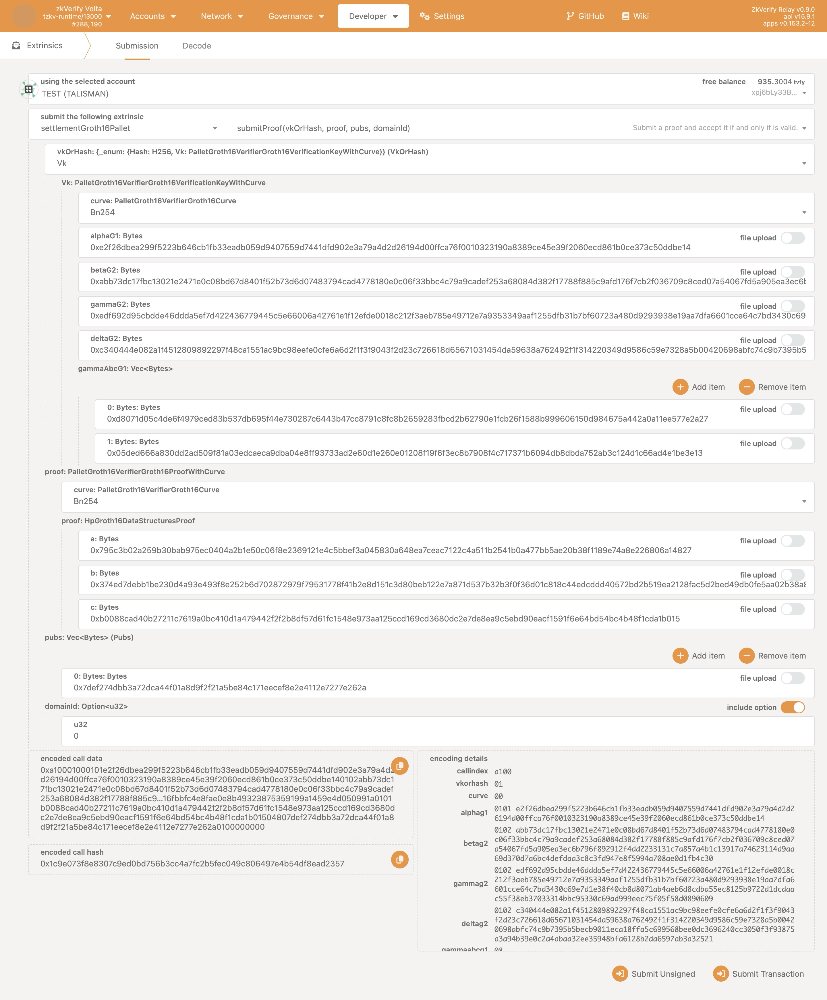
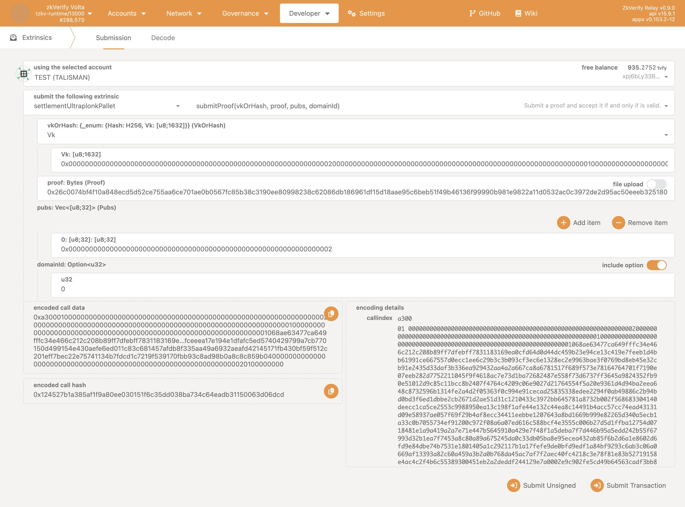
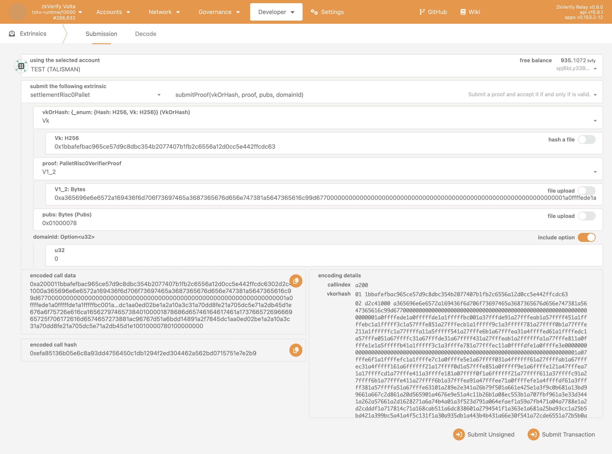

import Tabs from '@theme/Tabs';
import TabItem from '@theme/TabItem';

In this tutorial we'll go through the process of submitting compatible ZK proofs to the zkVerify chain using [PolkadotJS](https://polkadot.js.org/apps/?rpc=wss%3A%2F%2Ftestnet-rpc.zkverify.io#/extrinsics). You can navigate through all the supported proof types using the tabs below.

<Tabs groupId="verify-polkadotjs">

<TabItem value="groth16" label="Groth16">

1. Head to [polkadot.js.org frontend](https://polkadot.js.org/apps/?rpc=wss%3A%2F%2Ftestnet-rpc.zkverify.io#/extrinsics)
2. Select your account (you must have some tVFY).
3. Choose the `settlementGroth16Pallet`, and the `submitProof` extrinsic.
4. Inside the field `vkOrHash` select `Vk`
5. Fill in all the required fields by copy-pasting them from the json files obtained in the previous step. All the fields should be pasted without quotes. For the `gammaAbcG1` field and the `input` field you may need to click on the `Add Item` button a certain number of times, depending on the number of corresponding entries in your json files.
6. Enter the Domain ID corresponding to the domain you want to aggregate the proof for. Think of the Domain ID as the target chain for aggregation. You can find a list of available domains [here](../../architecture/04-proof-aggregation/05-domain-management.md).

7. Click on the `submitTransaction` button.

</TabItem>

<TabItem value="noir" label="Noir">
1. Head to [polkadot.js.org frontend](https://polkadot.js.org/apps/?rpc=wss%3A%2F%2Ftestnet-rpc.zkverify.io#/extrinsics)
2. Select your account (you must have some tVFY).
3. Choose the `settlementUltraplonkPallet`, and the `submitProof` extrinsic.
4. Inside the field `vkOrHash` select `Vk`
5. Fill in all the required fields by copy-pasting them from the hex files obtained in the previous step. You will need to fill the Vk, proof and public inputs. If you have more than one public inputs, you can click on the `Add Item` option to add more public inputs.
6. Enter the Domain ID corresponding to the domain you want to aggregate the proof for. Think of the Domain ID as the target chain for aggregation. You can find a list of available domains [here](../../architecture/04-proof-aggregation/05-domain-management.md).

7. Click on the `submitTransaction` button.

</TabItem>

<TabItem value="risc-zero" label="Risc Zero">

1. Head over to [PolkadotJs frontend](https://polkadot.js.org/apps/?rpc=wss%3A%2F%2Ftestnet-rpc.zkverify.io#/extrinsics) and select your account (you must have some tVFY).
2. Choose the `settlementRisc0Pallet` and the call `submitProof`.
3. Inside the field `vkOrHash` select `Vk` and paste the verification key (i.e. the image id of the code whose execution you want to verify), making sure to prepend it with hexadecimal prefix `0x`.
4. Inside the field `proof` choose the risc0 version used to generate the proof and load the binary file or paste the proof bytes, making sure to prepend it with hexadecimal prefix `0x`.
5. Inside the field `pubs` paste the public inputs, making sure to prepend it with hexadecimal prefix `0x`.
6. Enter the Domain ID corresponding to the domain you want to aggregate the proof for. Think of the Domain ID as the target chain for aggregation. You can find a list of available domains [here](../../architecture/04-proof-aggregation/05-domain-management.md).
7. Click on `submitTransaction`.

</TabItem>

<TabItem value="sxt" label="SxT">
1. Head to [polkadot.js.org frontend](https://polkadot.js.org/apps/?rpc=wss%3A%2F%2Ftestnet-rpc.zkverify.io#/extrinsics)
2. Select your account (you must have some tVFY).
3. Choose the `settlementProofOfSqlPallet`, and the `submitProof` extrinsic.
4. Inside the field `vkOrHash` select `Vk`
5. Fill in all the required fields by toggling the `file upload` switch, and uploading the vk, proof, and pubs files generated in the previous section.
6. Click on the `submitTransaction` button.
</TabItem>

</Tabs>

