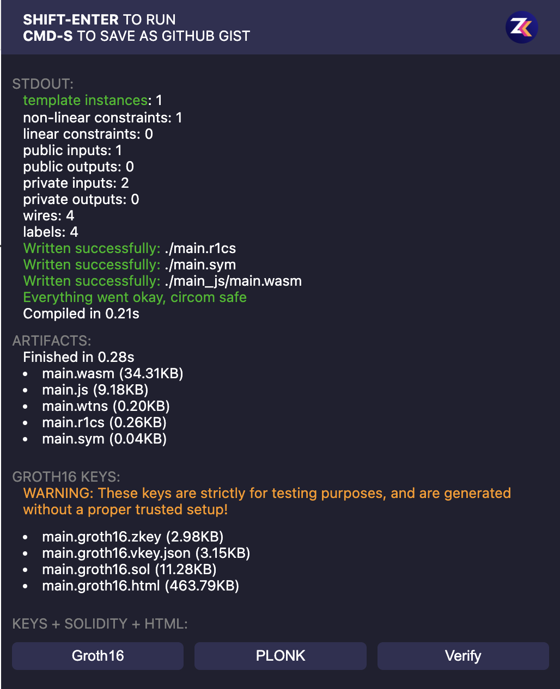
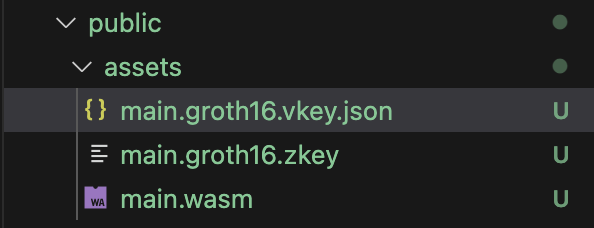
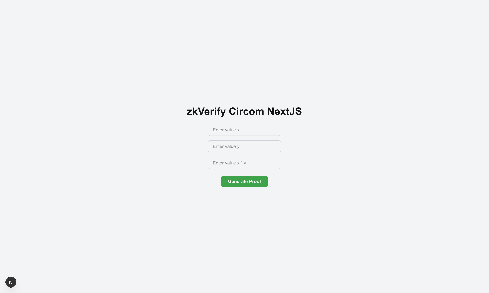
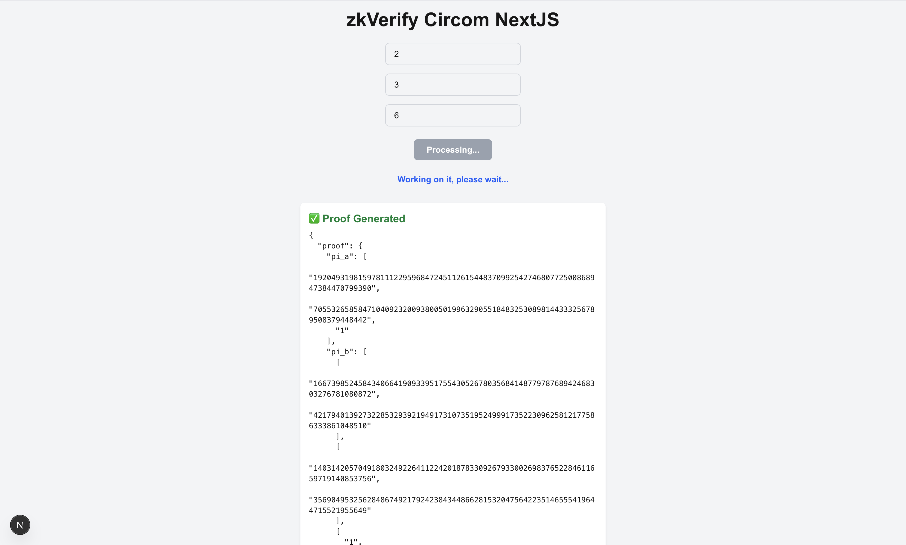
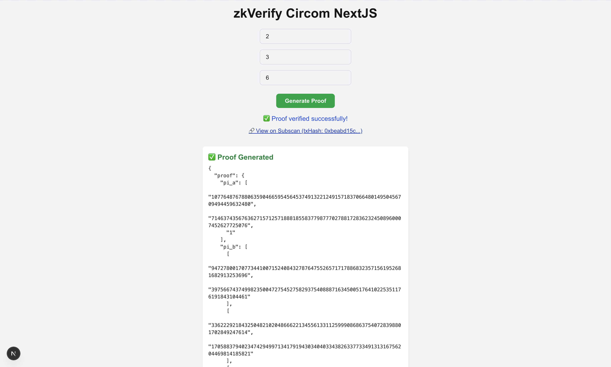

:::info
All the codebase used in the tutorial can be explored [here](https://github.com/zkVerify/tutorials/tree/main/nextjs-circom)
:::

This guide will walk you through the process of developing a NextJS application with client side proving supported by Circom and verifying the proofs with [relayer service](../02-getting-started/05-relayer.md). We will start from scratch by developing a simple ``circom`` circuit and then using ``snarkjs`` to generate proofs on the client side.

To start this tutorial, we will create our circuits using [zkRepl](https://zkrepl.dev/), which is very beginner-friendly. We won’t be diving deep into Circom DSL, but we will explore all the required code snippets. We will design a simple circuit, which takes three inputs(a,b,c) and constraints that ``c === (a*b)``. You can use the below code snippet for the circom circuit :

```circom
pragma circom 2.1.6;


template Example () {
    signal input a;
    signal input b;
    signal input c;
    
    (a*b) === c;
}

component main { public [ c ] } = Example();

/* INPUT = {
    "a": "5",
    "b": "5",
    "c": "25"
} */
```

After pasting the above given code snippet you can press ``Shift + Enter/Return`` to compile your circuit. Then click on ``groth16`` option shown on the right side bar. And then download three files namely ``main.wasm``, ``main.groth16.zkey`` and ``main.groth16.vkey.json``.




Once we have completed the above steps, we will now move to NextJS part. We will start by creating a new NextJS application using the following command:
``bash
npx create-next-app@latest
``

While creating a new NextJS application you will get the following options:
```bash
What is your project named? my-app
Would you like to use TypeScript? No / Yes # Select yes
Would you like to use ESLint? No / Yes # Select yes
Would you like to use Tailwind CSS? No / Yes # Select yes
Would you like your code inside a `src/` directory? No / Yes # Select yes
Would you like to use App Router? (recommended) No / Yes # Select no
Would you like to use Turbopack for `next dev`?  No / Yes # Select yes
Would you like to customize the import alias (`@/*` by default)? No / Yes # Select no
What import alias would you like configured? @/*
```

We would also like to install few required packages for our application namely ``axios`` and ``snarkjs``. First, we will go inside the project directory and run the npm install command.

```bash
cd your-project-name
```

```bash
npm i axios snarkjs
```

Next, open your NextJS app in any IDE you like. And explore the folder structure of your NextJS application. Create a sub directory named ``assets`` under the ``public`` directory. Copy all the three files you downloaded previously from ZKRepl and paste them inside ``assets`` directory.



Also create a new file named ``.env`` in the main project directory to store the Relayer API key which will be later used to verify proofs. Use the following code snippet:
```bash
API_KEY = "get your API Key from Horizen Labs team"
```

Now let's create a backend API in our NextJS application which will take the proof artifacts as inputs to verify our proof with the Relayer service. This API will be used by our frontend to verify the proofs generated on the client side. Create a new file named ``relayer.ts`` inside the ``api`` sub-directory. 

First we will import all the required packages like axios, snarkjs etc for our backend application. Next we create a handler function which takes ``POST`` API calls to verify proofs with proof artifacts passed as the body of the API request. We will declare the ``API_URL`` for our relayer service and import the ``vkey`` from the assets folder.

Before sending the proof for verification, we will register our verification key. This process is required once per proof and it decreases the cost of proof verification. After registering the verification key, we call the relayer endpoints to submit our proof for verification and to poll the status of proof verification. Once we get the ``IncludedInBlock`` event, we return the tx data to the frontend. You can check the [Relayer tutorials here](../02-getting-started/05-relayer.md).

```ts
import axios from "axios";
import { NextApiRequest, NextApiResponse } from "next";
import fs from "fs";
import path from "path";

export default async function handler(
  req: NextApiRequest,
  res: NextApiResponse
) {
  if (req.method !== "POST") {
    return res.status(405).json({ error: "Method not allowed" });
  }

  try {
    const API_URL = "https://relayer-api.horizenlabs.io/api/v1";

    if(fs.existsSync(path.join(process.cwd(), "public", "assets", "vkey.json")) === false) {
      await registerVk();
      await new Promise((resolve) => setTimeout(resolve, 5000));
    }

    const vk = fs.readFileSync(
      path.join(
        process.cwd(),
        "public",
        "assets",
        "vkey.json"
      ),
      "utf-8"
    );

    const params = {
      proofType: "groth16",
      vkRegistered: true,
      proofOptions: {
        library: "snarkjs",
        curve: "bn128",
      },
      proofData: {
        proof: req.body.proof,
        publicSignals: req.body.publicInputs,
        vk: JSON.parse(vk).vkHash || JSON.parse(vk).meta.vkHash,
      },
    };

    const requestResponse = await axios.post(
      `${API_URL}/submit-proof/${process.env.API_KEY}`,
      params
    );
    console.log(requestResponse.data);

    if (requestResponse.data.optimisticVerify != "success") {
      console.error("Proof verification, check proof artifacts");
      return;
    }

    while (true) {
      try{
        const jobStatusResponse = await axios.get(
          `${API_URL}/job-status/${process.env.API_KEY}/${requestResponse.data.jobId}`
        );
        if (jobStatusResponse.data.status === "IncludedInBlock") {
          console.log("Job Included in Block successfully");
          res.status(200).json(jobStatusResponse.data);
          return;
        } else {
          console.log("Job status: ", jobStatusResponse.data.status);
          console.log("Waiting for job to finalize...");
          await new Promise((resolve) => setTimeout(resolve, 5000)); // Wait for 5 seconds before checking again
        }
      }catch (error: any) {
        if (error.response && error.response.status === 503) {
          console.log("Service Unavailable, retrying...");
          await new Promise((resolve) => setTimeout(resolve, 5000)); // Wait for 5 seconds before retrying
        }
      }
    }
  } catch (error) {
    console.log(error);
  }
}

async function registerVk() {

  const API_URL = "https://relayer-api.horizenlabs.io/api/v1";
  const vk = fs.readFileSync(
    path.join(process.cwd(), "public", "assets", "main.groth16.vkey.json"),
    "utf-8"
  );

  const params = {
    proofType: "groth16",
    vk: JSON.parse(vk),
    proofOptions: {
      library: "snarkjs",
      curve: "bn128",
    },
  };

  console.log(params)

  await axios.post(
      `${API_URL}/register-vk/${process.env.API_KEY}`,
      params
    ).then((response) => {
      console.log("Verification key registered successfully:", response.data);
      fs.writeFileSync(
        path.join(process.cwd(), "public", "assets", "vkey.json"),
        JSON.stringify(response.data)
      );
    }).catch((error) => {
      fs.writeFileSync(
        path.join(process.cwd(), "public", "assets", "vkey.json"),
        JSON.stringify(error.response.data)
      );
    });

}
```

Now create a new sub directory named ``components`` under the ``pages`` directory inside the ``src`` folder. This folder will be used to store all the new components we will be building for our application. Create a new file named ``proof.tsx`` under the ``components`` directory.


Now we will go in detail about the proof component. First we will import ``useState`` from ``react`` and ``groth16`` from ``snarkjs``. We will declaring multiple useState, for maintaining state for our application. We will also declare a ``handleProofGeneration()`` to generate our proof, which uses the ``groth16.fullProve()`` function to generate the groth16 proof with our proof artifacts and inputs. Then we will call the relayer backend API we created earlier in this tutorial for proof verification and update our state as per the results. We will use the return function to render all the UI components required for this proof component. 

```tsx
"use client";

import { useState } from "react";
import { groth16 } from "snarkjs";

export default function ProofComponent() {
  const [x, setX] = useState("");
  const [y, setY] = useState("");
  const [result, setResult] = useState("");

  const [isLoading, setIsLoading] = useState(false);
  const [proofResult, setProofResult] = useState(null);
  const [errorMsg, setErrorMsg] = useState("");
  const [verificationStatus, setVerificationStatus] = useState("");
  const [txHash, setTxHash] = useState<string | null>(null);

  const handleGenerateProof = async () => {
    setIsLoading(true);
    setProofResult(null);
    setErrorMsg("");
    setVerificationStatus("");
    setTxHash(null);

    try {
      // Generate proof
      const { proof, publicSignals } = await groth16.fullProve(
        { a: x, b: y, c: result },
        "/assets/main.wasm",
        "/assets/main.groth16.zkey"
      );

      setProofResult({ proof, publicSignals });

      // Send to backend for verification
      const res = await fetch("/api/relayer", {
        method: "POST",
        headers: {
          "Content-Type": "application/json",
        },
        body: JSON.stringify({ proof: proof, publicInputs: publicSignals }),
      });

      const data = await res.json();

      if (res.ok) {
        setVerificationStatus("✅ Proof verified successfully!");
        if (data.txHash) {
          setTxHash(data.txHash);
        }
      } else {
        setVerificationStatus("❌ Proof verification failed.");
      }
    } catch (error) {
      console.error("Error generating proof or verifying:", error);
      setErrorMsg(
        "❌ Error generating or verifying proof. Please check your inputs and try again."
      );
    } finally {
      setIsLoading(false);
    }
  };

  return (
    <div className="flex flex-col items-center justify-center min-h-screen bg-gray-100 p-4">
      <h1 className="text-4xl font-bold mb-6">zkVerify Circom NextJS</h1>

      {/* Inputs */}
      <div className="flex flex-col space-y-4 w-64 mb-6">
        <input
          type="number"
          placeholder="Enter value x"
          value={x}
          onChange={(e) => setX(e.target.value)}
          className="px-4 py-2 rounded-lg border border-gray-300 focus:outline-none focus:ring-2 focus:ring-blue-500"
        />
        <input
          type="number"
          placeholder="Enter value y"
          value={y}
          onChange={(e) => setY(e.target.value)}
          className="px-4 py-2 rounded-lg border border-gray-300 focus:outline-none focus:ring-2 focus:ring-blue-500"
        />
        <input
          type="number"
          placeholder="Enter value x * y"
          value={result}
          onChange={(e) => setResult(e.target.value)}
          className="px-4 py-2 rounded-lg border border-gray-300 focus:outline-none focus:ring-2 focus:ring-blue-500"
        />
      </div>

      {/* Generate Proof Button */}
      <button
        onClick={handleGenerateProof}
        disabled={isLoading}
        className={`${
          isLoading
            ? "bg-gray-400 cursor-not-allowed"
            : "bg-green-600 hover:bg-green-700"
        } text-white font-semibold px-6 py-2 rounded-lg`}
      >
        {isLoading ? "Processing..." : "Generate Proof"}
      </button>

      {/* Loading */}
      {isLoading && (
        <div className="mt-6 text-blue-600 font-semibold">
          Working on it, please wait...
        </div>
      )}

      {/* Error Message */}
      {errorMsg && (
        <div className="mt-6 text-red-600 font-medium">{errorMsg}</div>
      )}

      {/* Verification Result */}
      {verificationStatus && (
        <div className="mt-4 text-lg font-medium text-blue-700">
          {verificationStatus}
        </div>
      )}

      {/* TX Hash */}
      {txHash && (
        <div className="mt-2 text-blue-800 underline">
          <a
            href={`https://zkverify-testnet.subscan.io/extrinsic/${txHash}`}
            target="_blank"
            rel="noopener noreferrer"
          >
            🔗 View on Subscan (txHash: {txHash.slice(0, 10)}...)
          </a>
        </div>
      )}

      {/* Output */}
      {proofResult && (
        <div className="mt-8 bg-white shadow-md p-4 rounded-lg w-full max-w-xl">
          <h2 className="text-xl font-bold mb-2 text-green-700">
            ✅ Proof Generated
          </h2>
          <pre className="text-sm overflow-x-auto whitespace-pre-wrap break-words">
            {JSON.stringify(proofResult, null, 2)}
          </pre>
        </div>
      )}
    </div>
  );
}

```

Next open ``index.tsx`` file to use our proof component. Replace the whole file content with the follwing code snippet:
```tsx
import Image from "next/image";
import { Geist, Geist_Mono } from "next/font/google";
import ProofComponent from "./components/proof";

const geistSans = Geist({
  variable: "--font-geist-sans",
  subsets: ["latin"],
});

const geistMono = Geist_Mono({
  variable: "--font-geist-mono",
  subsets: ["latin"],
});

export default function Home() {
  return (
    <>
    <ProofComponent />
    </>
  );
}

```

Now we have completed all our steps for our NextJS application. You can start the application by running the following command:
```bash
npm run dev
```

You can open the url, you got in the terminal window and you should get the following screen:



Fill up the x, y and result field with any value you want where ``result = x*y`` and click on ``Generate Proof`` button. Once proof is generated it will shown below the button:



After proof generation, it will automatically send the proof for verification using the Relayer service and will show status ``working on it ``. Once the proof is verified, you will get the txHash and you can click on it to check it on our explorer.


